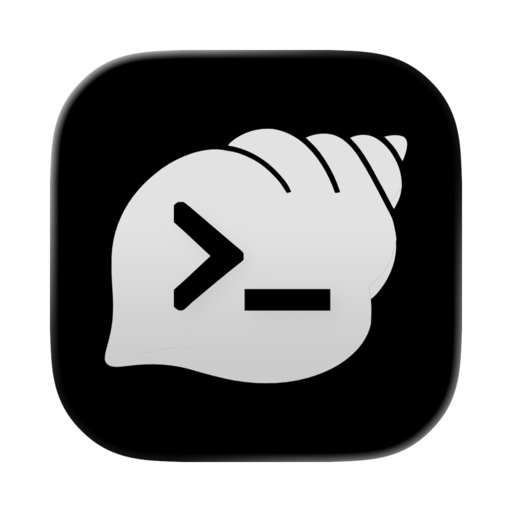
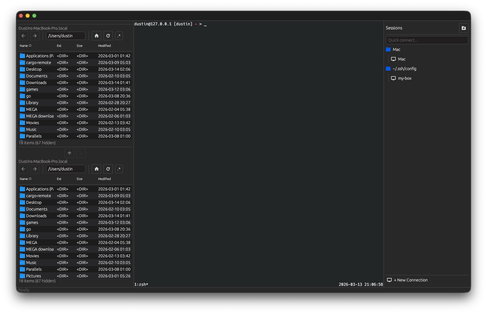

<p align="center">
  
</p>

<h1 align="center">Conch</h1>

<p align="center">
  A fast, cross-platform terminal emulator with an extensible native plugin system.<br/>
  Built in Rust. Runs on macOS, Windows, and Linux.
</p>

<p align="center">
  <a href="https://github.com/an0nn30/rusty_conch/actions/workflows/ci.yml">
    
  </a>
  <a href="https://github.com/an0nn30/rusty_conch/releases">
    
  </a>
  <a href="LICENSE">
    
  </a>
</p>

---



## Why Conch?

Most terminal emulators do one thing well. SSH clients do another. File transfer tools are a third app entirely. Conch puts them all in one window — terminal, SSH sessions, SFTP file browser — and a native plugin system that lets you build your own tools on top.

Think MobaXterm, but open source, cross-platform, and extensible.

## Features

**Terminal** — Full terminal emulation powered by [alacritty_terminal](https://github.com/alacritty/alacritty). 256-color, truecolor, mouse reporting, bracketed paste, tabs, multi-window.

**SSH Sessions** (plugin) — Save connections with proxy jump support, organized in folders. Password and key authentication. Quick-connect from the sidebar. Parses `~/.ssh/config` automatically.

**File Explorer** (plugin) — Dual-pane local and remote file browsing. Upload and download with real-time progress tracking. Direct SFTP transfers via a zero-overhead C ABI vtable — no JSON serialization or base64 encoding for file data.

**Lightweight** — No Electron. Native GPU-accelerated rendering via OpenGL. Near-zero idle CPU usage.

**Zen Mode** — `Cmd+Shift+Z` hides all panels and the status bar for a distraction-free terminal.

## Plugin System

Conch has a **native plugin system** built on a stable C ABI. Plugins are compiled shared libraries (`.dylib` on macOS, `.so` on Linux, `.dll` on Windows) that communicate with the host through a vtable of function pointers.

This means plugins can be written in any language that can produce a C-compatible shared library, though the SDK provides first-class Rust support via the `conch_plugin_sdk` crate.

### What can plugins do?

- **Register sidebar panels** with live-updating declarative widgets
- **Provide session backends** — the SSH plugin adds SSH terminal sessions to Conch
- **Communicate with other plugins** via pub/sub events and RPC queries
- **Show dialogs** — forms, confirmations, prompts, alerts
- **Access the clipboard**, set status bar text, show notifications
- **Register SFTP vtables** for zero-overhead cross-plugin file transfer
- **Persist configuration** via a per-plugin key-value config store

### Shipped plugins

| Plugin | Location | What it does |
|--------|----------|--------------|
| **[conch-ssh](plugins/conch-ssh/)** | Right panel | SSH session manager with server tree, quick connect, SFTP, host key verification |
| **[conch-files](plugins/conch-files/)** | Left panel | Dual-pane file explorer with local/remote browsing and direct SFTP transfer |

### Java plugins

Conch supports **Java plugins** via an embedded JVM. Any JVM language works (Java, Kotlin, Scala, Groovy). The SDK JAR is embedded in the binary — no external files needed. Java plugins have full access to logging, menu items, notifications, status bar, clipboard, dialogs (prompt, confirm, alert, forms), config persistence, inter-plugin communication, and terminal/tab control.

See the [Java Plugin SDK section](docs/plugin-sdk.md#java-plugins) in the SDK reference.

### Lua plugins

Conch also supports lightweight **Lua 5.4 plugins** for quick scripting. Drop a `.lua` file in `~/.config/conch/plugins/` and it appears in the Plugins tab.

```lua
-- plugin-name: Hello World
-- plugin-description: A simple action plugin
-- plugin-type: action
-- plugin-version: 1.0.0

function setup()
    app.log("info", "Hello from a plugin!")
    app.register_menu_item("Tools", "Say Hello", "say_hello")
end

function on_event(event)
    if type(event) == "table" and event.action == "say_hello" then
        app.notify("Hello", "Hello from a plugin!", "success")
    end
end
```

Example Lua plugins are included in [`examples/plugins/`](examples/plugins/):

| Plugin | Type | What it does |
|--------|------|--------------|
| **System Info** | Panel | Live hostname, memory, disk, CPU load, top processes |
| **Port Scanner** | Panel | TCP port scanning with service identification |
| **Encrypt/Decrypt** | Action | AES encryption (CBC, GCM, ECB) with PBKDF2 key derivation |
| **Tmux Sessions** | Panel | List, attach, rename, kill tmux sessions from a sidebar |
| **Demo Bottom Panel** | Bottom Panel | Service dashboard with tables, stats, progress bars, live logs |

### Plugin development

See the **[Native Plugin SDK Reference](docs/plugin-sdk.md)** for the full API, widget system, session backends, and inter-plugin communication.

### VS Code extension

The [Conch Plugin Support](editors/vscode/) extension provides Lua API completions, hover docs, and `conch check` diagnostics for Lua plugin development.

## Installation

### Download

Grab the latest build from the [Releases](https://github.com/an0nn30/rusty_conch/releases) page:

| Platform | Artifact |
|----------|----------|
| macOS (Universal) | `.dmg` |
| Windows | `.msi` installer or portable `.exe` |
| Linux (AMD64) | `.deb` / `.rpm` |
| Linux (ARM64) | `.deb` / `.rpm` |

### Build from source

Requires Rust 1.85+ (edition 2024).

```bash
git clone https://github.com/an0nn30/rusty_conch.git
cd rusty_conch
cargo build --release -p conch_app
```

Plugins are built automatically as workspace members. The compiled `.dylib`/`.so`/`.dll` files are placed in `target/release/` and discovered by the app at runtime.

<details>
<summary>Linux dependencies</summary>

```bash
sudo apt-get install -y \
  libxcb-render0-dev libxcb-shape0-dev libxcb-xfixes0-dev \
  libxkbcommon-dev libwayland-dev libgtk-3-dev libssl-dev pkg-config
```

</details>

## Keyboard Shortcuts

> On Linux/Windows, replace `Cmd` with `Ctrl`.

| Shortcut | Action |
|----------|--------|
| `Cmd+T` | New tab |
| `Cmd+W` | Close tab |
| `Cmd+1`–`9` | Switch to tab N |
| `Cmd+Shift+N` | New window |
| `Cmd+Shift+E` | Toggle left panel |
| `Cmd+Shift+R` | Toggle right panel |
| `Cmd+Shift+J` | Toggle bottom panel |
| `Cmd+Shift+Z` | Zen mode (hide all panels + status bar) |
| `Cmd+Q` | Quit |

All shortcuts are configurable — see [Configuration](#configuration) below. Plugins can also register their own keybindings.

## Configuration

Conch uses a TOML config at `~/.config/conch/config.toml` (Linux/macOS) or `%APPDATA%\conch\config.toml` (Windows).

Standard [Alacritty config](https://alacritty.org/config-alacritty.html) sections (`[window]`, `[font]`, `[colors]`, `[terminal]`) work as-is. Conch adds its own sections:

```toml
[conch.keyboard]
new_tab = "cmd+t"
close_tab = "cmd+w"
new_window = "cmd+shift+n"
quit = "cmd+q"
zen_mode = "cmd+shift+z"
toggle_left_panel = "cmd+shift+e"
toggle_right_panel = "cmd+shift+r"
toggle_bottom_panel = "cmd+shift+j"

[conch.ui]
native_menu_bar = true     # Use native macOS menu bar (macOS only, default: true)
font_family = ""           # UI font family (empty = system default)
font_size = 13.0

[conch.plugins]
enabled = true                     # Master switch — false disables all plugins
native = true                      # Native (.dylib/.so/.dll) plugins
lua = true                         # Lua (.lua) plugins
java = true                        # Java (.jar) plugins (disabling skips JVM startup)
search_paths = ["/extra/plugins"]  # Additional plugin discovery directories
```

> **Plugin keybindings** are registered by plugins themselves via `register_menu_item` (with an optional keybind argument), not in the config file.

## Project Structure

```
crates/
  conch_app/          GUI application (eframe/egui) — the main binary
  conch_core/         Config loading, color schemes, shared types
  conch_pty/          PTY abstraction and connector
  conch_plugin/       Plugin host — Lua runner, JVM runtime, native manager, plugin bus
  conch_plugin_sdk/   SDK for native plugins — HostApi vtable, widgets, FFI types
plugins/
  conch-ssh/          SSH session manager (native plugin)
  conch-files/        Dual-pane file explorer (native plugin)
java-sdk/             Java Plugin SDK (JAR + sources + javadoc)
editors/
  vscode/             VS Code extension for Lua plugin development
examples/
  plugins/            Example Lua plugins (tmux-sessions, system-info, etc.)
docs/
  plugin-sdk.md       Plugin SDK reference (Native, Java, Lua)
```

## Contributing

Conch is actively developed. Bug reports, feature requests, and pull requests are welcome.

## License

[Apache 2.0](LICENSE)
